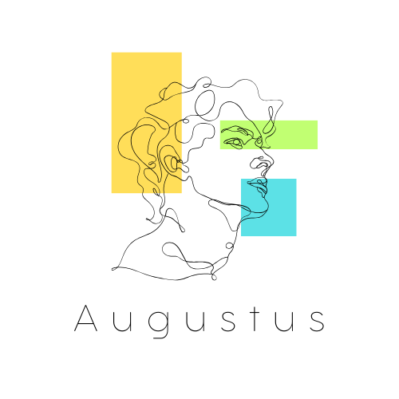
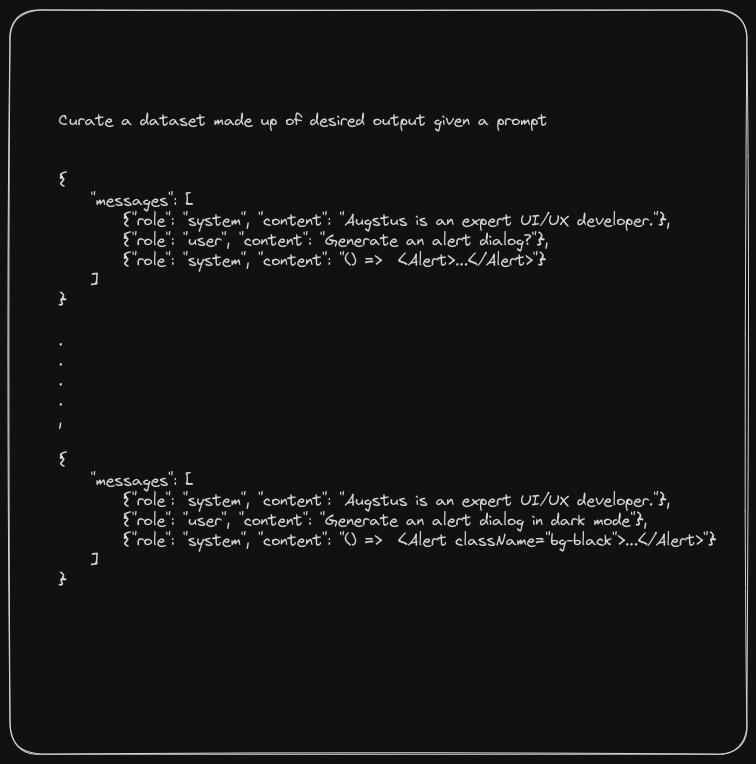
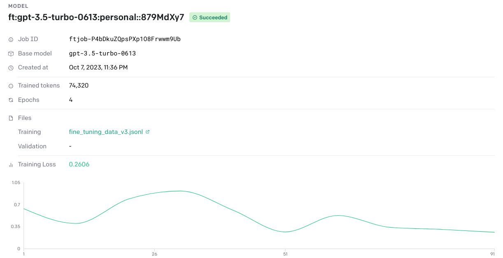
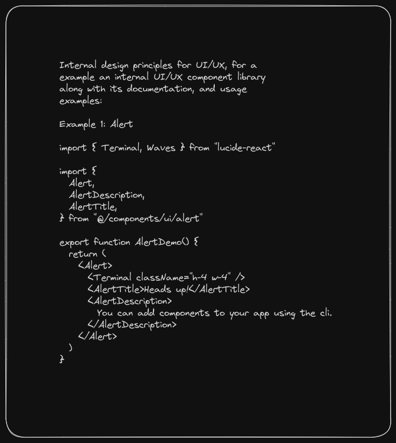
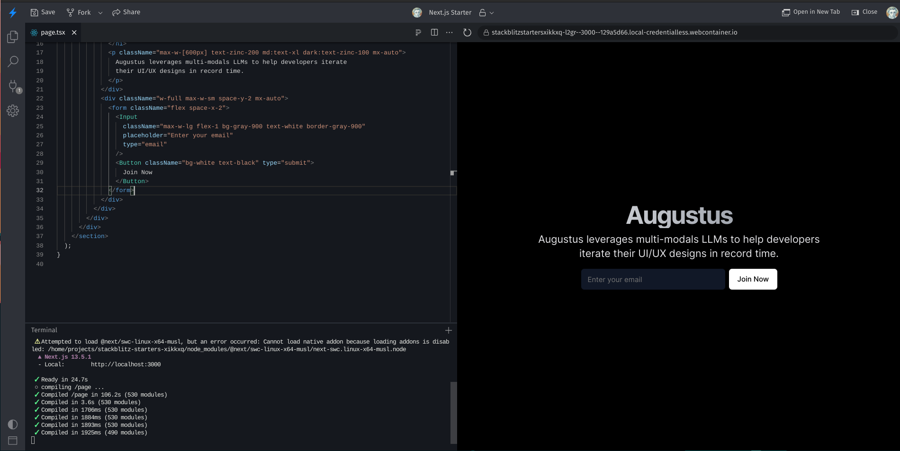
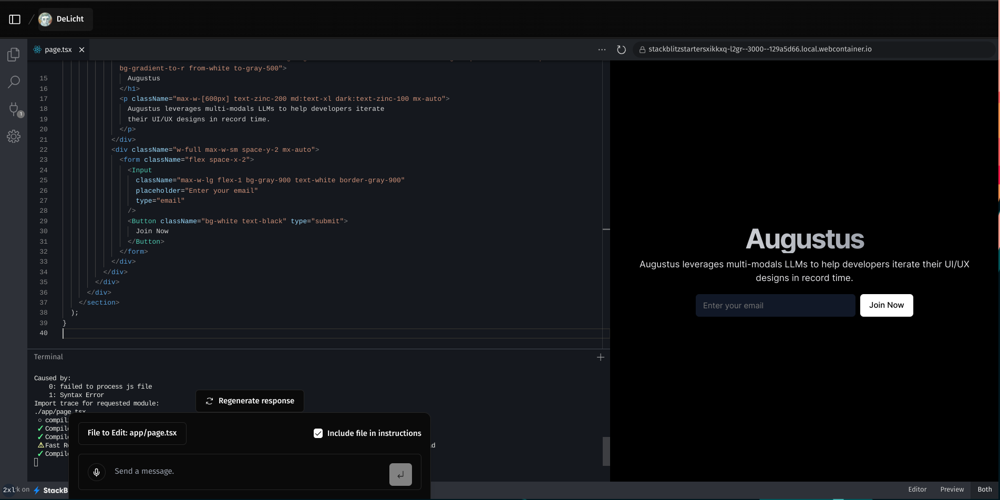

# Augustus - AI-Powered UI/UX Builder (made in 2023)

<div align="center">
  <h1>🎨 Augustus</h1>
  <p><strong>An AI-powered multi-modal chatbot for building beautiful UI/UX components in Next.js</strong></p>
  
  <p>
    <a href="#features"><strong>Features</strong></a> •
    <a href="#tech-stack"><strong>Tech Stack</strong></a> •
    <a href="#getting-started"><strong>Getting Started</strong></a> •
    <a href="#usage"><strong>Usage</strong></a> •
    <a href="#fine-tuning"><strong>Fine-tuning</strong></a> •
    <a href="#deployment"><strong>Deployment</strong></a>
  </p>
</div>

<br/>

## 🚀 Overview

Augustus is an intelligent AI chatbot specifically designed to help developers build beautiful, responsive UI/UX components using Next.js 13, Tailwind CSS, and Radix UI. It leverages fine-tuned AI models to understand design requirements and generate production-ready React components with proper TypeScript support.

<div align="center">
  
  <p><em>Augustus - Building beautiful UI components through natural language</em></p>
</div>

## ✨ Features

- **🤖 AI-Powered UI Generation** - Fine-tuned GPT model for UI/UX component creation
- **🎯 Next.js 13 Ready** - Built with App Router, Server Components, and Edge Runtime
- **🎨 Component Library Integration** - Seamless integration with shadcn/ui components
- **💬 Real-time Chat Interface** - Interactive chat experience for component requests
- **🔐 Authentication** - Secure user authentication with NextAuth.js
- **📱 Responsive Design** - Mobile-first approach with Tailwind CSS
- **🌙 Dark/Light Mode** - Theme switching with system preference detection
- **📊 Chat History** - Persistent chat sessions with Vercel KV storage
- **🚀 Edge Runtime** - Optimized for performance and scalability

## 🛠️ Tech Stack

### Frontend
- **Next.js 13** - React framework with App Router
- **React 18** - UI library with Server Components
- **TypeScript** - Type-safe development
- **Tailwind CSS** - Utility-first CSS framework
- **Radix UI** - Headless component primitives
- **shadcn/ui** - Beautiful component library

### Backend & AI
- **OpenAI API** - Fine-tuned GPT-3.5-turbo model
- **Vercel AI SDK** - Streaming chat UI
- **Vercel KV** - Redis-based key-value storage
- **NextAuth.js** - Authentication solution

### Development Tools
- **ESLint** - Code linting
- **Prettier** - Code formatting
- **pnpm** - Package manager

## 🚀 Getting Started

### Prerequisites

- Node.js 18+ 
- pnpm (recommended) or npm
- OpenAI API key
- Vercel account (for deployment)

### Installation

1. **Clone the repository**
   ```bash
   git clone <your-repo-url>
   cd augustus
   ```

2. **Install dependencies**
   ```bash
   pnpm install
   ```

3. **Set up environment variables**
   Create a `.env.local` file:
   ```env
   # OpenAI
   OPENAI_API_KEY=your_openai_api_key
   
   # Authentication
   AUTH_SECRET=your_auth_secret
   AUTH_GITHUB_ID=your_github_oauth_id
   AUTH_GITHUB_SECRET=your_github_oauth_secret
   
   # Vercel KV (for production)
   KV_URL=your_kv_url
   KV_REST_API_URL=your_kv_rest_api_url
   KV_REST_API_TOKEN=your_kv_rest_api_token
   KV_REST_API_READ_ONLY_TOKEN=your_kv_read_only_token
   ```

4. **Run the development server**
   ```bash
   pnpm dev
   ```

5. **Open your browser**
   Navigate to [http://localhost:3000](http://localhost:3000)

## 💬 Usage

### Chat Interface

1. **Start a conversation** - Begin chatting with Augustus about your UI needs
2. **Describe your component** - Explain what you want to build (e.g., "Create a user profile card")
3. **Get instant code** - Receive production-ready React components with TypeScript
4. **Iterate and refine** - Ask for modifications or improvements

### Example Prompts

- "Create a responsive navigation bar with mobile menu"
- "Build a data table with sorting and pagination"
- "Design a contact form with validation"
- "Make a dashboard card with charts and metrics"

### Generated Components

Augustus generates components that:
- Use the latest Next.js 13 patterns
- Include proper TypeScript types
- Follow Tailwind CSS best practices
- Integrate seamlessly with shadcn/ui
- Are responsive and accessible

## 🎯 Fine-tuning

This project includes a fine-tuned GPT model specifically trained for UI/UX development. The training process involved:

- **Custom Dataset** - Curated examples of UI components and design patterns
- **Specialized Prompts** - System prompts optimized for code generation
- **Component Library Knowledge** - Deep understanding of shadcn/ui components
- **Best Practices** - Training on modern React and Next.js patterns

### Training Data

The fine-tuning dataset includes:
- UI component examples
- Design system patterns
- Responsive layouts
- Accessibility guidelines
- Performance optimizations

### Fine-tuning Process

<div align="center">
  
  <p><em>Step 1: Curating and preparing the training dataset</em></p>
</div>

<div align="center">
  
  <p><em>Step 2: Fine-tuning the model on the curated dataset</em></p>
</div>

### Component Library Integration

<div align="center">
  
  <p><em>Augustus leverages shadcn/ui component library for consistent, beautiful designs</em></p>
</div>

### Development Workflow

<div align="center">
  
  <p><em>Traditional development workflow</em></p>
</div>

<div align="center">
  
  <p><em>Development workflow enhanced with Augustus AI assistance</em></p>
</div>

## 🚀 Deployment

### Vercel (Recommended)

1. **Push to GitHub**
   ```bash
   git add .
   git commit -m "Initial commit"
   git push origin main
   ```

2. **Deploy with Vercel**
   - Connect your GitHub repository to Vercel
   - Set environment variables in Vercel dashboard
   - Deploy automatically on push

3. **Set up Vercel KV**
   - Create a KV database in Vercel
   - Update environment variables with KV credentials

### Environment Variables for Production

Ensure these are set in your production environment:
- `OPENAI_API_KEY`
- `AUTH_SECRET`
- `AUTH_GITHUB_ID`
- `AUTH_GITHUB_SECRET`
- `KV_URL`
- `KV_REST_API_URL`
- `KV_REST_API_TOKEN`
- `KV_REST_API_READ_ONLY_TOKEN`

## 🔧 Development

### Available Scripts

```bash
# Development
pnpm dev              # Start development server
pnpm build            # Build for production
pnpm start            # Start production server
pnpm preview          # Preview production build

# Code Quality
pnpm lint             # Run ESLint
pnpm lint:fix         # Fix ESLint issues
pnpm type-check       # Run TypeScript type checking
pnpm format:write     # Format code with Prettier
pnpm format:check     # Check code formatting
```

### Project Structure

```
augustus/
├── app/                    # Next.js app directory
│   ├── api/               # API routes
│   ├── chat/              # Chat pages
│   └── layout.tsx         # Root layout
├── components/             # React components
│   ├── ui/                # shadcn/ui components
│   └── chat/              # Chat-related components
├── lib/                    # Utility functions
├── prompts/                # AI system prompts
├── data/                   # Training datasets
└── slides/                 # Presentation materials
```

## 🤝 Contributing

1. Fork the repository
2. Create a feature branch (`git checkout -b feature/amazing-feature`)
3. Commit your changes (`git commit -m 'Add amazing feature'`)
4. Push to the branch (`git push origin feature/amazing-feature`)
5. Open a Pull Request

## 📄 License

This project is licensed under the MIT License - see the [LICENSE](LICENSE) file for details.

## 🙏 Acknowledgments
- **Kui Dev** - This codebase was forked from and mostly based on https://kui-dev.vercel.app/
